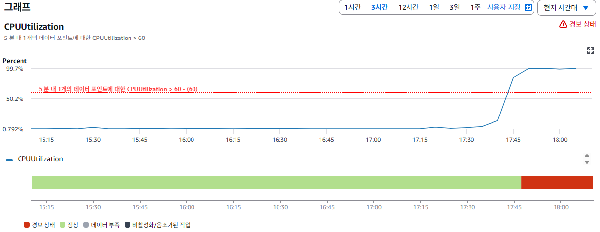

# 2026-05-22 성능테스트

---

## 1. 테스트 목적

- 본 테스트를 통해 vercel 및 ec2 기반 시스템의 안정 구간, 성능 저하가 시작되는 임계 구간, 그리고 서비스가 정상적으로 동작하기 어려운 한계 구간을 구분하여 분석하는 것을 목표로 한다.
- 이를 위해 점진적 부하 테스트를 통해 시스템의 임계점과 한계점을 도출하고, 스파이크 테스트를 통해 트래픽 증가에 대한 대응 능력을 검증하며 소크 테스트를 통해 장시간 부하 상황에서의 안정성을 확인한다.

## 2. 관찰 지표

- 지연율 (avg, p95)
- 에러발생률
- websocket 연결 끊김 빈도 (cloudwatch 로그에서 watchdog 재연결 로그 발생 여부로 관찰)
- 리소스 사용량

## 3. 테스트 시나리오

### 1. 수행할 테스트 종류

1. 베이스라인 테스트
    - 목적 : 이후 테스트의 기준 설정
2. 점진적 부하 테스트
    - 목적 : 시스템의 임계 및 한계 구간 확인
    - k6을 사용해서 API 요청 부하 생성
    - 동시 사용자 수(VUs)를 10 → 30 → 50 → 100 단계적으로 증가
    - 각 단계에서  2~3분 동안 부하 유지
    - 동시에 websocket 연결 상태를 관찰
3. 스파이크 테스트
    - 목적 : 순간 대응 확인
    - VUs를 10 → 100 → 10 으로 변화
        - 이 때 100인 구간은 30초로 설정
    - 그 외엔 점진적 부하 테스트와 동일
4. 소크 테스트
    - 목적 : 시간 누적 문제 확인
    - VUs 30을 10분 유지

### 2. 테스트할 API

- 주요 기능 구성 : 메모리 생성, 삭제, 수정, 조회, 리스트 조회
- 삭제와 수정은 생성에 비해 실제 사용 빈도가 낮을 것으로 판단해 테스트 대상에서 제외
- 메모리 상세 조회와 리스트 조회는 같은 조회로 간주
- 메모리 생성 시 바로 상세 조회 페이지로 이동함
- 따라서 메모리 → 상세 조회로 이어지는 실제 사용자 흐름을 반영하고 이를 사용자 트랜잭션으로 간주 : 테스트

### 3. 사용할 테스트 데이터

- 실제 사용 패턴에 가까운 데이터를 사용
- 프로젝트의 목적상 데이터를 처음 등록할 때에는 사진 없이 위치값과 간단한 짧은 내용만 적을 것으로 예상됨

### 4. 베이스라인

- 단일 사용자가 사용한다는 가정 하에 기본 성능 측정
- 측정된 베이스라인을 기준으로 이후 부하 테스트 결과를 비교
- 일반적인 사용자 체감 기준 (약 500ms ~ 1s)도 참고하여 같이 비교에 사용

### 5. VUs

- 최대 처리 용량이 불명확한 초기 성능 테스트인 점을 고려 → 점진적으로 부하 증가시키는 방식 사용
- 성능 저하 및 에러 발생 구간을 기준으로 시스템의 임계점 도출하기

### 6. 각 구간별 테스트 지속 시간

- 판단 기준 : 안정적인 결과를 도출했는가
- 최소 2~3분으로 하되, 시스템이 안정적인 상태에 도달하지 않을 경우 추가로 연장.

### 7. 성공/실패 기준

- 임계점
    - websocket 끊김 시작
    - 지연율 : 베이스라인 대비 2배 증가시 혹은 p95가 1초 초과시
    - 에러율 : 1~2%
    - 리소스 : CPU 70~80% 지속시
- 한계점
    - websocket 대량으로 끊기기 시작
    - 지연율 : 베이스라인 대비 4배 증가시 혹은 p95가 2초 초과
    - 에러율 : 5% 이상 지속
    - 리소스 : CPU 90% 이상 or OOM

### 8. 추가 고려 사항

- 부하 테스트 시 단일 계정 사용으로 인해 AI 호출 빈도 제한이 발생하는 문제를 확인하였다. 이를 해결하기 위해 테스트 환경에서는 해당 제한을 비활성화하여 실제 서비스에서 발생 가능한 부하를 재현하였다.

## 4. 테스트 결과 및 분석

### 1. 베이스라인 테스트

| 회차 | avg | p95 | 에러율 |
| --- | --- | --- | --- |
| 1 | 2.35 | 3.1 | 0 |
| 2 | 1.36 | 1.86 | 0 |
| 3 | 1.41 | 1.95 | 0 |
| 4 | 1.56 | 1.71 | 0 |
| 5 | 1.62 | 1.78 | 0 |
| 6 | 0.83 | 0.83 | 0 |
| 7 | 1.14 | 1.44 | 0 |
| 8 | 0.84 | 0.85 | 0 |
| 9 | 1.36 | 1.86 | 0 |
| 10 | 1.29 | 1.73 | 0 |
- 1회차를 vercel cold start로 간주. 데이터가 안정된 2회차 부터 10회차까지 평균 계산
- avg : 1.27초, p95 : 1.56초, 에러율 0%
- 따라서 임계점과 한계점 설정은 다음과 같다.

|  | avg | p95 |
| --- | --- | --- |
| 임계점 | 2.76 | 3.42 |
| 한계점 | 5.52 | 6.84 |
- 베이스라인 측정 결과 평균 응답시간이 약 1초 이상으로 나타나 초기 응답 성능 개선 여지가 있음을 확인하였다.

### 2. 점진적 부하 테스트

- 지연율 avg : 787ms, p95 : 918ms
- 에러율 0%
- CPU :

- 테스트 과정에서 80 ~ 100 VU 구간에서 EC2 인스턴스의 CPU 사용률이 99%에 도달한 이후, SSM 접속이 불가능한 상태가 발생.
- 과부하 시점에 인스턴스 접속이 불가능해 상세 로그 확인 어려움 → cloudwatch 지표와 supabase의 created_At 컬럼 기준으로 분석.
- CPU 13% → 84% 급등 구간 존재
- 재부팅 후에 복구

### 3. 테스트 결과 요약

- 점진적 부하 테스트 수행 중 특정 구간에서 시스템 성능 저하 및 장애 발생
- vercel api는 정상이나 ec2 에서 ai 요청 처리 중 병목 발생
- cpu 사용률 급등 및 인스턴스 응답 불가 상태 발생
- 단일 worker 구조에서 처리 한계 존재

### 4. 원인 분석

- 해당 시스템은 AI 요청 처리가 단일 EC2 인스턴스 내에 단일 Worker 에 집중된 구조 → 요청 증가시 병렬 처리 제한됨
- 요청 즉시 처리 방식 → 큐와 버퍼 존재 x → 처리 지연 누적, 일정 시점 이후 cpu 사용률 급격히 상승

### 5. 임계점 및 한계점 분석

- 임계점 : 약 50 VU 부근에서 요청 처리 간격 증가 및 CPU 사용률 상승이 시작되며, 시스템이 성능 저하 구간에 진입한 것으로 판단
- 한계점 : 약 100 VU 부근에서 CPU 사용률이 99%에 도달하고 인스턴스 접속이 불가능해지는 등 장애 상태가 발생. 해당 구간을 시스템의 한계점으로 정의.

### 6. 결론 및 개선 필요 사항

현재 구조에서는 AI 요청이 단일 Worker에 집중되어 병목이 발생하며, 일정 수준 이상의 부하에서 시스템이 안정적으로 동작하지 못하는 한계가 확인

따라서 안정적인 처리를 위해 다음과 같은 구조 개선이 필요:

- 요청 처리를 위한 Queue 도입
- AI Worker 다중화 (병렬 처리 구조)
- 수평 확장이 가능한 구조로의 개선

### 7. 후속 계획

- 큐 기반 구조로 개선 후 부하 테스트 다시 진행